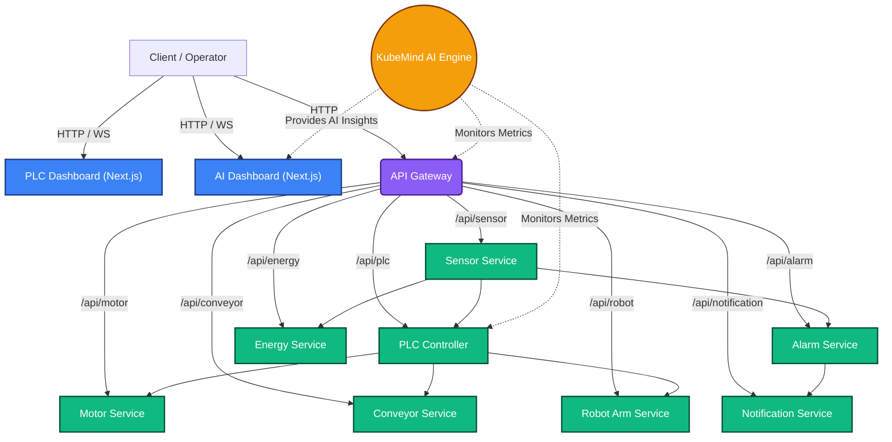

# Industrial PLC Automation System

Welcome to the **Industrial PLC Automation** project! This repository contains a microservices-based architecture designed to simulate, monitor, and control an automated manufacturing plant using modern web technologies and Kubernetes.

The system is integrated with the **KubeMind AI Platform**, an autonomous site reliability engineering (SRE) engine that uses AI to monitor cluster health, detect anomalies, predict failures, and suggest autonomous remediation strategies.

## System Architecture

The architecture is built upon an API Gateway pattern that routes requests to individual industrial microservices. The state and metrics of these microservices are actively monitored by the KubeMind AI metrics engine.



## Key Components

1. **API Gateway (`api-gateway`)**: Centralized entry point on port 4000. Handles routing and WebSocket connections.
2. **PLC Controller (`plc-controller`)**: The "brain" of the factory line, dispatching commands to actuators and reading from sensors.
3. **Actuator Services**: 
   - `motor-service`: Controls industrial motors.
   - `conveyor-service`: Manages conveyor belt speeds and states.
   - `robot-arm-service`: Coordinates robotic arm kinematics.
4. **Monitoring & Alerting**:
   - `sensor-service`: Generates mock telemetry data (temperature, pressure).
   - `energy-service`: Tracks power consumption.
   - `alarm-service`: Evaluates threshold breaches.
   - `notification-service`: Dispatches alerts.
5. **Dashboards**:
   - **PLC Dashboard**: Real-time factory floor UI.
   - **AI Dashboard**: Real-time cluster topology, anomaly detection, and AI SRE recommendations.

## How to Run Locally

You can launch the entire stack using the provided startup script. This will boot all microservices, Next.js dashboards, and the Python FastAPI metrics engine concurrently.

```bash
# Make the script executable
chmod +x ./start_services.sh

# Run the stack
./start_services.sh
```

**Note for KubeMind AI Features:** 
To enable real-time metrics gathering for the AI dashboard, you must have your local Kubernetes cluster (e.g., `minikube`) running and `kube-prometheus-stack` installed.

## Kubernetes Deployment

To deploy the services to your Kubernetes cluster:

```bash
# Build Docker images for all services
./scripts/build-plc-images.sh

# Apply all manifests to the cluster
./scripts/deploy-plc.sh
```

## Stopping the Services

If you ran the services locally using `./start_services.sh`, simply press `Ctrl+C` in the terminal running the script. The script's trap will automatically capture the signal and gracefully terminate all background processes.
