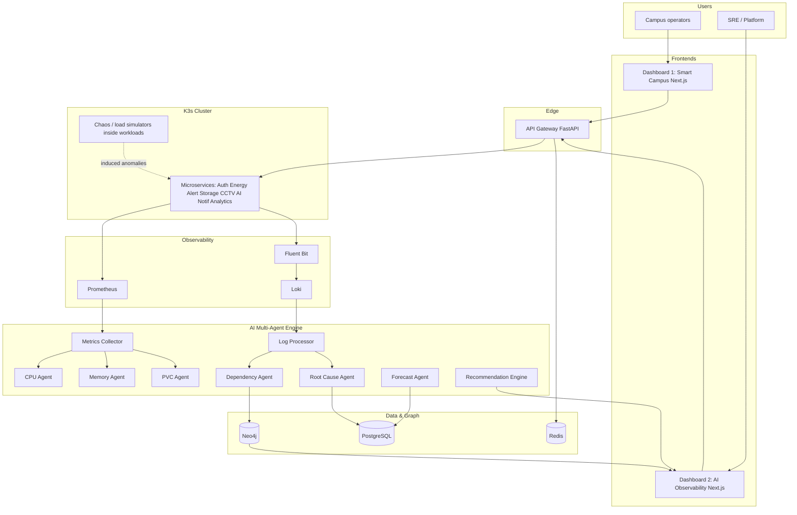
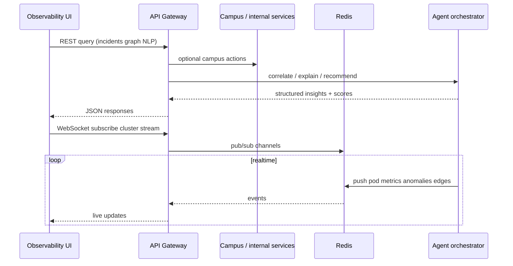
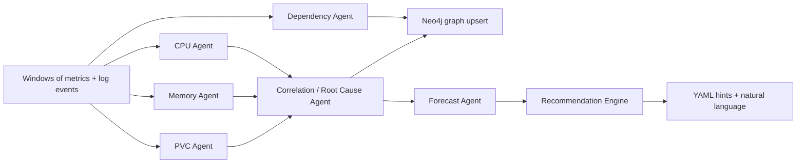
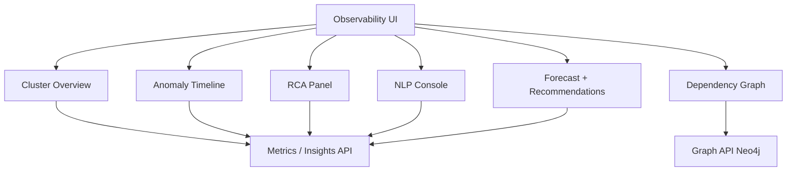
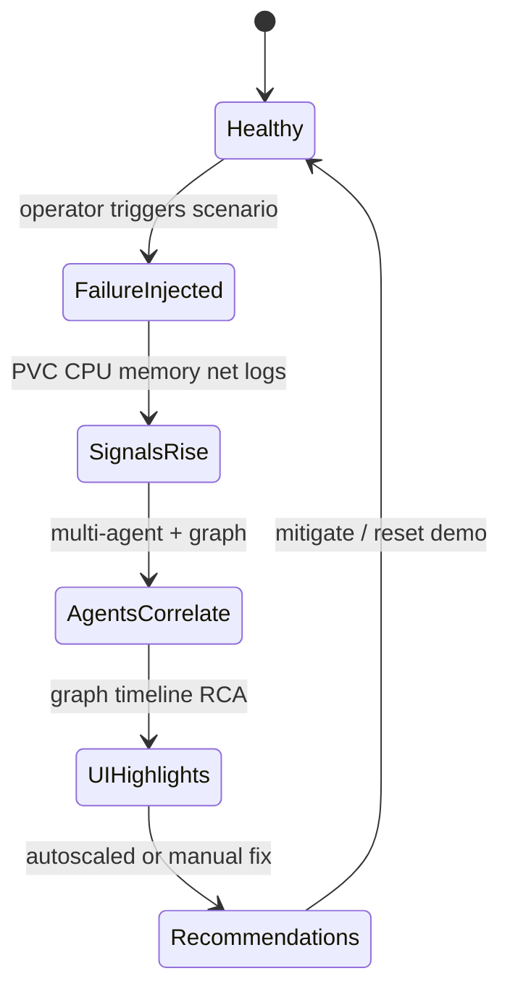

# KubeMind AI — End-to-End Project Workflow

**Tagline:** AI-Powered Autonomous Kubernetes Intelligence Platform for Smart Campus Infrastructure.

This document ties together the **Smart Campus workload generator** and the **AI observability platform**, from cluster setup through demo storytelling.

---

## 1. What You Are Building (Two Products, One Demo)

| Stream | Role | Outcome |
|--------|------|---------|
| **Smart Campus** | Synthetic “real” app | Pods, traffic, storage, failures, dependencies |
| **KubeMind Observability** | Intelligence layer | Metrics/logs → agents → graph → RCA → NLP → forecasts |

The campus stack **creates the signal**; KubeMind **explains and recommends**.

---

## 2. Layered Architecture (Logical Flow)



---

## 3. Request & Streaming Workflow (API Gateway)



---

## 4. Observability Pipeline (Must-Have Path)

1. **Instrument / scrape:** `kube-state-metrics`, `cAdvisor`, `node-exporter`, service `/metrics` where needed.
2. **Store series:** Prometheus (short retention OK for demo; Thanos optional later).
3. **Ship logs:** Fluent Bit → Loki; label with `namespace`, `pod`, `container`, `app`.
4. **Consume in backend:** Metrics Collector pulls PromQL; Log Processor queries Loki for errors, restarts, trace-like patterns.
5. **Feed agents:** Normalized time windows + event stream → agent tasks (async FastAPI workers or queue).

---

## 5. AI Multi-Agent Workflow (LangGraph-Oriented)



**Agent responsibilities (contract):**

| Agent | Input | Output |
|-------|--------|--------|
| CPU | CPU, throttling, QPS | spike events, severity |
| Memory | RSS, OOMKilled, growth | leak risk, OOM risk |
| PVC | IO latency, volume usage | saturation, latency anomalies |
| Dependency | logs, optional mesh, synthetic campus calls | nodes/edges, weights |
| Root Cause | aligned timestamps across signals | causal chain + confidence |
| Forecast | historical windows | 30m / 24h projections |

Persist: incidents + explanations in **PostgreSQL**; live session + WS fanout in **Redis**; topology in **Neo4j**.

---

## 6. Frontend Workflow (Two Dashboards)

### Dashboard 1 — Smart Campus (believable, lighter)

- **Purpose:** Show “campus is running” and **drive** metrics (API calls, charts, fake CCTV load).
- **Pages:** Overview → Attendance (RFID sim) → Energy → CCTV → Notifications.
- **Interaction loop:** User actions or timers → backend endpoints → DB/cache → charts (Recharts) → optional “scenario” buttons (start load, trigger leak, etc.) if you wire them.

### Dashboard 2 — AI Observability (hero)

- **Cluster overview:** pod counts, namespaces, CPU/mem/net/PVC aggregates (from gateway aggregating Prom).
- **Dependency graph:** Cytoscape.js or React Flow; nodes = workloads; edges = inferred or instrumented calls; color = latency or anomaly score (**Neo4j** or precomputed layout API).
- **Anomaly timeline:** merged agent events + AI blurbs.
- **RCA panel:** structured chain from Root Cause Agent + confidence.
- **NLP:** question → RAG over incident store + graph summary → answer with affected services and fix.
- **Forecast + recommendations:** charts + actionable cards (limits, replicas, namespace isolation).



---

## 7. Demo Story Workflow (The “Winning Moment”)

**Act 0 — Baseline**

- Cluster healthy; graph green/yellow; timeline quiet; forecasts stable.

**Act 1 — Inject failure (example: storage stress)**

- Campus or dedicated job: large sequential writes to a PVC-backed volume.
- Side effects: DB write latency, API retries, CPU on notification path, memory pressure on analytics (synthetic or real).

**Act 2 — Detect**

- PVC Agent flags latency / utilization; Memory/CPU agents flag knock-on; logs show retries.

**Act 3 — Graph reacts**

- Dependency Agent / RCA updates **Neo4j**; UI edges shift color; critical path highlights.

**Act 4 — Explain**

- Root Cause Agent emits chain: *PVC → DB writes → retries → CPU/mem hotspots* with **confidence**.

**Act 5 — Recommend**

- Recommendation Engine: e.g. scale mem for `analytics-service`, IO class for storage, or isolate `storage-service` namespace; optional **patch snippet**.

**Act 6 — NLP (optional live)**

- “Why did the cluster slow at 3:40 PM?” → retrieves that incident window + graph slice → concise narrative.



---

## 8. Anomaly Catalog ↔ Implementation

| Demo anomaly | Campus / workload hook | Primary signals |
|--------------|-------------------------|-----------------|
| CPU spike | tight loop endpoint or job | CPU throttle, latency |
| Memory leak | gradual allocator in a pod | RSS growth, OOM risk |
| PVC stress | bulk writer | IO wait, volume usage |
| Network storm | client hammering APIs | QPS, errors, saturation |
| Restart storm | exit code loop / bad probe | `kube_pod_container_status_restarts_total`, logs |

---

## 9. Suggested Build Order (Full Workflow for Engineering)

1. **K3s + base manifests** — namespaces, limits, ingress (if any).
2. **Observability stack** — Prometheus, Loki, Fluent Bit, Grafana (debug only).
3. **Minimal FastAPI gateway** — health, proxy to Prom/Loki read-only, WS stub.
4. **One “vertical” campus service** — generates metrics + logs end-to-end.
5. **PostgreSQL + Redis + Neo4j** — docker-compose or Helm alongside cluster.
6. **Metrics Collector + Log Processor** — scheduled pulls → normalized tables/cache.
7. **Dependency Agent v0** — static graph + light inference from log patterns.
8. **Dashboard 2 skeleton** — cluster overview + fake graph → wire real graph API.
9. **Remaining campus services + Dashboard 1** — pages that hit APIs and drive load.
10. **Anomaly simulators** — feature flags or admin endpoints to trigger scenarios.
11. **LangGraph pipeline** — CPU/MEM/PVC → RCA → recommendations; persist incidents.
12. **Forecast** — start with Prophet or simple baselines; upgrade to LSTM/TCN if needed.
13. **NLP layer** — RAG over incidents + summarized graph context.
14. **Hardening** — auth on gateway, rate limits, demo reset scripts.

---

## 10. Success Criteria (Definition of Done for the Demo)

- [ ] Campus UI visibly “lives” (charts/logs update without manual refresh hacks).
- [ ] Observability UI shows **real** cluster-derived metrics for your workloads.
- [ ] Dependency graph updates when load/failure scenarios run.
- [ ] At least **one** end-to-end RCA narrative with confidence, tied to a real injected event.
- [ ] At least **one** NLP question answered using stored incident context.
- [ ] **One** forecast view (even rule-based) with a clear time horizon.
- [ ] **One** actionable recommendation with resource or topology rationale.

---

## 11. Repository Layout (Suggested, When You Scaffold)

```text
apps/
  campus-web/          # Next.js Dashboard 1
  observability-web/   # Next.js Dashboard 2
services/
  api-gateway/
  metrics-collector/
  log-processor/
  ai-engine/
infra/
  k8s/                 # K3s manifests / Helm
  compose/             # Neo4j, Postgres, Redis for dev
observability/
  prometheus/
  loki/
  fluent-bit/
docs/
  PROJECT_WORKFLOW.md  # this file
```

---

*This workflow is the narrative spine for implementation, demos, and stakeholder walkthroughs.*
